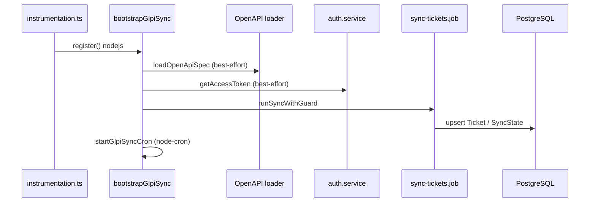

# GLPI — sincronização, cache e resiliência

## Sequência de arranque (Next)

## Arranque do worker CLI

O ficheiro `apps/frontend/scripts/glpi-worker-cli.ts` carrega primeiro `.env` na raiz e `apps/frontend/.env.local`, depois importa dinamicamente `bootstrapGlpiWorkerProcess` (sem guard de HMR).

## Concorrência

- **Mesmo processo:** `runSyncWithGuard` usa `isSyncRunning` para não sobrepor execuções.
- **Vários processos / réplicas:** cada instância Next com `instrumentation` pode agendar o mesmo cron; mitigações: um único **`npm run start:worker`**, ou `GLPI_CRON_DISABLED=1` nas réplicas que só servem HTTP (a primeira sync no arranque ainda corre; ajuste se precisar de `GLPI_SKIP_BOOTSTRAP` no build).

## Token OAuth2

- Cache em memória com expiração antecipada (`expires_in - 60s`).
- `inFlightTokenPromise` deduplica pedidos simultâneos de novo token.

## Variáveis relevantes

| Variável | Papel |
|----------|--------|
| `GLPI_BASE_URL`, `GLPI_TOKEN_URL` | API e endpoint de token |
| `GLPI_DOC_URL` | OpenAPI para descobrir caminhos |
| `GLPI_TICKETS_PAGE_SIZE`, `GLPI_TICKETS_FETCH_CONCURRENCY` | Volume e paralelismo da sync |
| `CRON_EXPRESSION` | Agenda do `node-cron` |
| `GLPI_SKIP_BOOTSTRAP` | `1` durante `next build` para não contactar GLPI/BD |
| `GLPI_CRON_DISABLED` | `1` desliga só o agendamento periódico (`node-cron`) |

## Referências externas (manter atualizadas)

- Documentação da instância: `GLPI_DOC_URL` (OpenAPI) e portal GLPI da organização.
- [Documentação GLPI](https://glpi-project.org/documentation/) — versão da API em produção.

## Observabilidade

- Ao concluir com sucesso, `sync-cron` regista `durationMs`, `loaded`, `saved`, `failed` no log.
